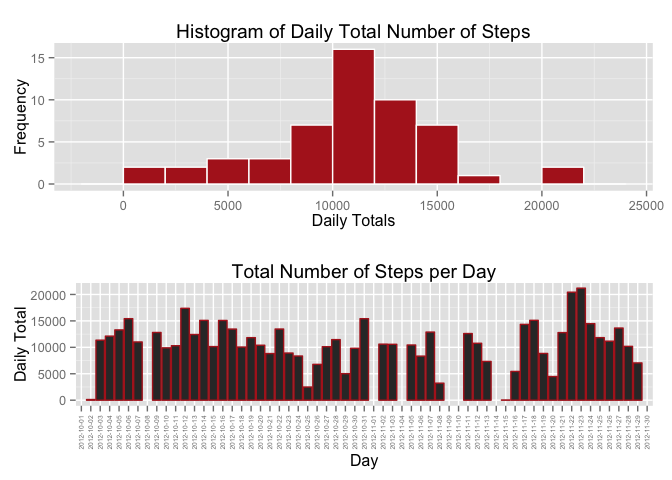
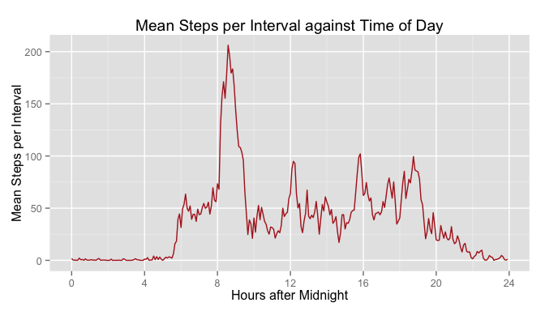
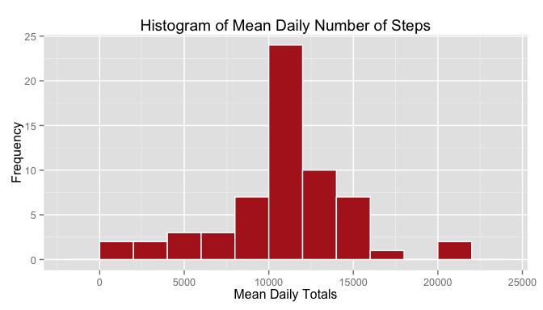
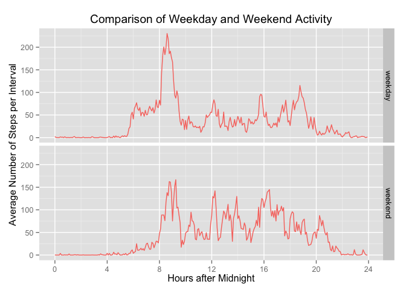

# Reproducible Research: Peer Assessment 1
Dana Murray  
07 November 2015  


## Introduction

This assignment is about analyzing personal activity data recorded by an activity monitoring device from an anonymous individual during October and November 2012.
The [raw data][1] consists of steps taken during a five minute interval, the date and the interval identifier.

[1]: https://d396qusza40orc.cloudfront.net/repdata%2Fdata%2Factivity.zip/ "raw data"


## Loading and Preprocessing the Data


After reading the data 
there is a bit of preprocessing to obtain the total number of steps per day, as well as the average number of steps per five minute interval, averaged over days.

The interval identifiers, such as 125 and 1345, which signify the times 01:25 and 13:45, are converted to decimal hours after midnight.


```r
actfile <- "./activity.csv"
act <- read.csv(actfile, header = TRUE, sep = "," ) 
```


```r
library(dplyr)
```

```
## 
## Attaching package: 'dplyr'
## 
## The following objects are masked from 'package:stats':
## 
##     filter, lag
## 
## The following objects are masked from 'package:base':
## 
##     intersect, setdiff, setequal, union
```

```r
library(ggplot2)
library(grid)
library(lubridate)

totalbyday <- summarize(group_by(act, date), daytotal= sum(steps)) 
meanbyinterval <- summarize(group_by(act, interval), intervalmean = mean(steps, na.rm=TRUE))
meanbyinterval <- mutate(meanbyinterval, charint=as.character(interval))
```


```r
padleading0s = function (x){
    if      (nchar(x)==1) (paste("000",x, sep =""))
    else if (nchar(x)==2) (paste("00", x, sep =""))
    else if (nchar(x)==3) (paste("0",  x, sep =""))
    else x
}
meanbyinterval <- mutate(meanbyinterval, hhmm = sapply(charint, padleading0s)) %>%
                  mutate(hh = substr(hhmm,1,2), mm = substr(hhmm,3,4)) %>%
                  mutate(hrdec = as.numeric(hh) + (1/60)*as.numeric(mm))
```


```r
meanperday   <- sprintf("%.2f", mean(totalbyday$daytotal, na.rm=TRUE))
medianperday <- median(totalbyday$daytotal, na.rm=TRUE)
```


The histogram of the total number of steps per day, having excluded the missing values, shows that there have been many days when our subject performed around 12 000 steps per day. Then there are fewer and fewer days the more the total number of steps departs from this central value. 

The mean number of steps taken per day is 10766.19 and the median is
10765 steps per day.

Interestingly, there are two days with more than 20 000 steps, much more than the about 17 000 steps on the third most active day. 
I was so curious to see on what days our anonymous subject was so active that I plotted his daily totals against the date, expecting that these days would have been during a weekend.
Our subject's most active day was on Friday 2012-11-23 closely followed by Thursday 2012-11-22, which turns out to have been Thanksgiving.


```r
plot11 <- ggplot(totalbyday, aes(totalbyday$daytotal)) + 
          geom_histogram(binwidth=2000, fill="firebrick", col="white") +
           labs(title="Histogram of Daily Total Number of Steps") +
          labs(x="Daily Totals", y="Frequency") 


plot12 <- ggplot(totalbyday, aes(x=factor(date), y=daytotal)) +
    geom_bar(color="firebrick", stat="identity") +
    labs(x="Day", y="Daily Total") +
    labs(title = "Total Number of Steps per Day") +
    theme(axis.text.x=element_text(angle=90, size=5, vjust=0.5))

pushViewport(viewport(layout = grid.layout(2, 1)))
print(plot11, vp = viewport(layout.pos.row = 1, layout.pos.col = 1))
print(plot12, vp = viewport(layout.pos.row = 2, layout.pos.col = 1))
```

```
## Warning: Removed 8 rows containing missing values (position_stack).
```

 


## What is the average daily activity pattern?


```r
g <- ggplot(meanbyinterval, aes(x=hrdec, y=intervalmean)) +
     geom_line(color="firebrick") +
     labs(x="Hours after Midnight", y="Mean Steps per Interval") +
     labs(title = "Mean Steps per Interval against Time of Day") + 
     scale_x_continuous(breaks=seq(0, 24, 4))
g
```

 


```r
intervalandmax   <- meanbyinterval[which.max(meanbyinterval$intervalmean),]
intervalofmax <- intervalandmax[1]
maxval <- sprintf("%.2f",intervalandmax[2])
intmaxchar <- padleading0s(as.character(intervalofmax))
maxtime <- paste(substr(intmaxchar, 1, 2), ":", substr(intmaxchar, 3, 4), sep="")
```

The maximum average number of steps per interval of 206.17 occurs at interval number 835 which is the 5-minute interval following 08:35.


## Imputing missing values


```r
numna <- sum(is.na(act$steps))
numintervals <- dim(act)[1]
percna <- sprintf("%.2f", 100 * numna / numintervals)
```
1. There are 2304 missing values out of the 17568 in the dataset, hence for a percentage of 13.11 % of the intervals no data was recorded. 

2. Intuitively, one would expect an interval on a particular day to be more similar to intervals at the same time of the day for other days, than to the average of intervals for that particular day. 
I therefore used the strategy of imputing NA's by using the corresponding non-missing value interval means.

3. From the original dataset I created a new dataset by imputing the missing values using the non-NA interval means averaged over days.

4. I redid the analysis, this time including the imputed values.


```r
actfilled <- merge(meanbyinterval, act, by = 'interval')    
actfilled <- arrange(actfilled, date, interval)
actfilled[is.na(actfilled$steps), 'steps'] <- actfilled[is.na(actfilled$steps), 'intervalmean']
```


```r
totalbydayfilled <- summarize(group_by(actfilled, date), daytotal= sum(steps))
meanperdaynona   <- sprintf("%.2f", mean(  totalbydayfilled$daytotal, na.rm=TRUE))
medianperdaynona <- sprintf("%.2f", median(totalbydayfilled$daytotal, na.rm=TRUE))

g <- ggplot(totalbydayfilled, aes(totalbydayfilled$daytotal)) + 
          geom_histogram(binwidth=2000, fill="firebrick", col="white") +
           labs(title="Histogram of Mean Daily Number of Steps") +
          labs(x="Mean Daily Totals", y="Frequency") 
g
```

 


The histogram now has a more pronounced peak.
The mean number of steps take per day is now 10766.19 and the median is 10766.19 steps per day.

It is a bit surprising that the mean number of steps per day remained exactly the same.
This would have been the case if the missing values had been perfectly evenly distributred over days.

It turns out that there are 8 days where none of the intervals has any value, and no NA's on any other days.
The number of NA's in the dataset should therefore equal 8 days times 288 intervals per day, which is indeed 2304 as reported above.  

The upshot is that my imputation strategy would have added eight days with a total of 10766.19 steps, which is the original mean number of steps per day.
Hence, the mean of number of steps per day does not change.
Upon hindsight it becomes clear that I would have obtained the same histogram if I had used the mean number of steps per day for the missing interval values.

That the median is now the same as the mean can be explained by starting off with the median being close to the mean and including several, in this case eight, daily totals equal to the mean into the dataset.


## Are there differences in activity patterns between weekdays and weekends?


1. Weekday activity is contrasted to weekend activity by first introducing a new factor variable with the two levels "weekday" and "weekend". The mean number of steps per interval is then found averaged separately over weekdays and over weekend days.

2. The panel plot compares the time series for the weekday activity to the weekend activity.

From the plots we see that our subject rises at about 06:00 during the week.
From 08:00 to about 08:30 he is very active.
During the day he does not appear to move about much, except at around 12:00 and 16:00.
There is another spurt of activity at around 19:00.
He seems to go to bed at about 22:00.

During the weekends he becomes active at about 08:00, maintain a higher activity level during the weekend days, and then also retires at around 22:00.


```r
actfilled <- mutate(actfilled, 
    dayofweek = weekdays(as.Date(date), abbreviate = TRUE))
actfilled <- mutate(actfilled, typeofday = as.factor( 
        ifelse(dayofweek == "Sat" | dayofweek == "Sun", "weekend", "weekday" )))
meanbyintervalpertypeofday <-   
    summarize(group_by(actfilled,  typeofday, hrdec), 
              typeintervalmean = mean(steps, na.rm=TRUE))
```


```r
g <- ggplot(meanbyintervalpertypeofday, aes(hrdec, typeintervalmean)) +
    geom_line(aes(color = "brickred"), show_guide=FALSE) + 
    facet_grid(typeofday ~ .) +
    labs(title = expression( "Comparison of Weekday and Weekend Activity")) +
    labs(x = "Hours after Midnight") + 
    labs(y = expression ("Average Number of Steps per Interval") ) + 
     scale_x_continuous(breaks=seq(0, 24, 4))
print(g)
```

 


